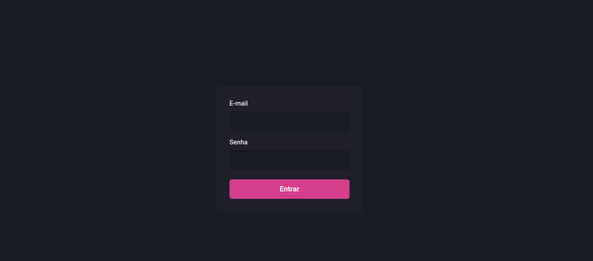
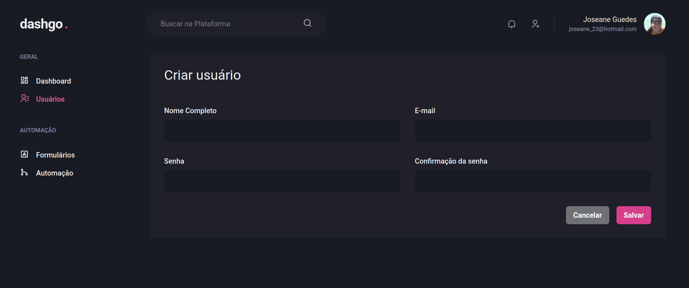
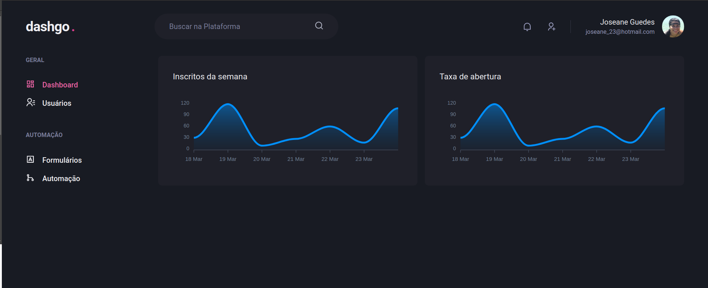

<h1 align="center">   </h1>

<h1 align="center" color="pink" > Dashgo <span style='color: #FF10F0'>.<span> </h1>

<p align="center">
   
  
  
  
  
  
</p>

<br>

# 👩‍💻 About

<p align="justify">Dashgo is a Dashboard developed from scratch. A dashboard is an important tool used for information management and business intelligence! In this chapter, we built an administrative interface with registration, authentication flow and listing.
</p>

<br>

# 🎨 Layout

<div align="center">
  <p align="center">
    
  </p>
   <p align="center">
    
  </p>
   <p align="center">
    
  </p>
</div>

<br>


# :rocket: Tecnologies

- [ReactJS](https://reactjs.org/)
- [NextJS](https://nextjs.org/)
- [TypeScript](https://www.typescriptlang.org/)
- [Swiper](https://swiperjs.com/react)
- [MirageJS](https://miragejs.com/)
- [React Hook Form](https://react-hook-form.com/)
- [Yup](https://github.com/jquense/yup)
- [Chackra UI](https://chakra-ui.com/)
- [ApexCharts.js](https://apexcharts.com/)
- [React Query](https://apexcharts.com/)


<br>

# 🔧 Run Locally

Clone the project

```bash
  git clone git@github.com:https://github.com/Joseane-Guedes/dashgo.git
```

Go to the project directory

```bash
  cd dashgo
```

Install dependencies

```bash
  yarn
```

Start the server

```bash
  yarn dev
```

# :closed_book: License

Released in 2021 :closed_book: License

This project is under the [MIT license](./LICENSE).

#

<!-- <p align="center">
   <b> &#60;/&#62; by <a href="https://www.linkedin.com/in/joseane-guedes/">Joseane Guedes</a></b>
</p> -->

Made with :purple_heart: by [Rocketseat](https://rocketseat.com.br/ignite) :rocket: and [Joseane Guedes ](https://github.com/Joseane-Guedes) :woman_technologist:
